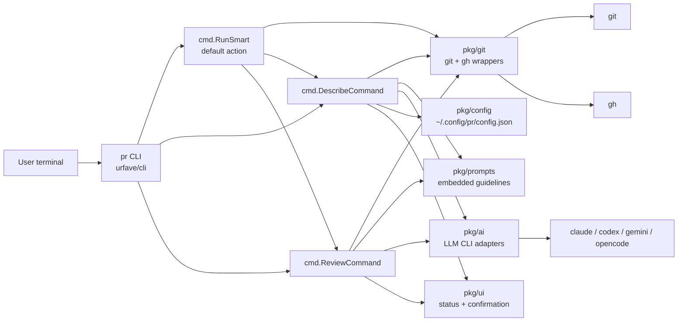
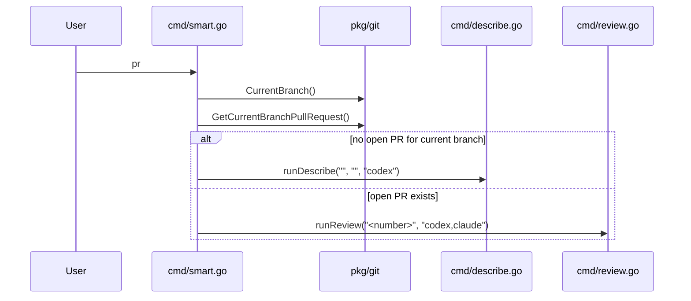
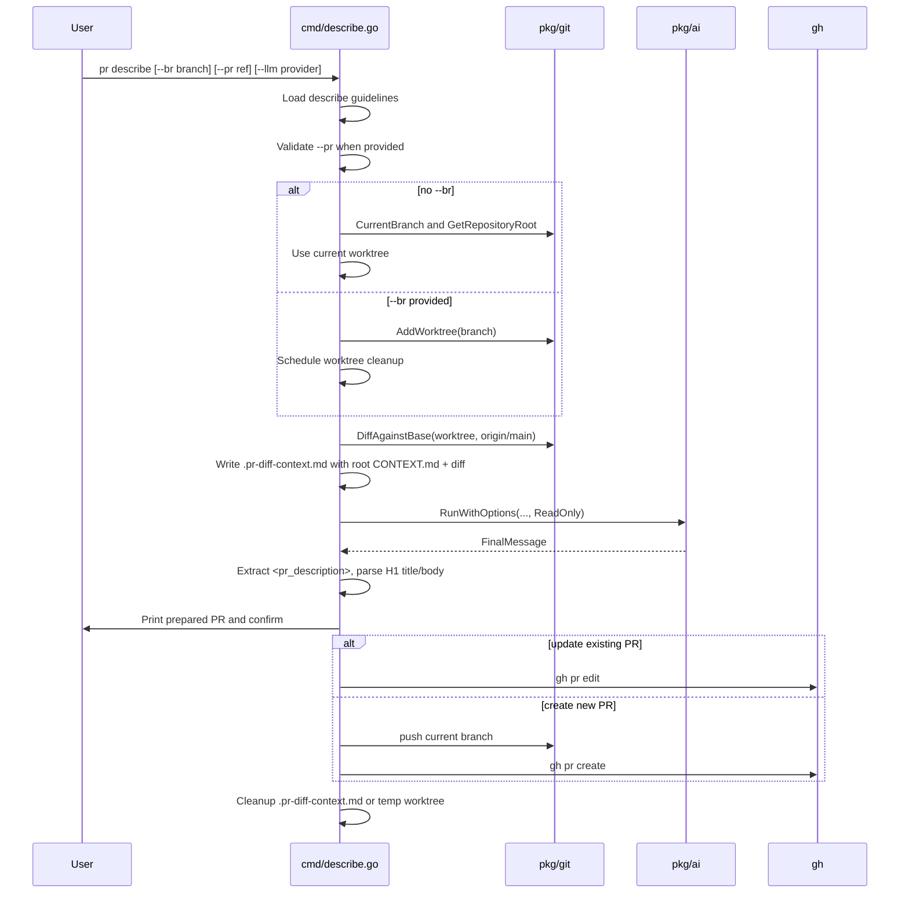
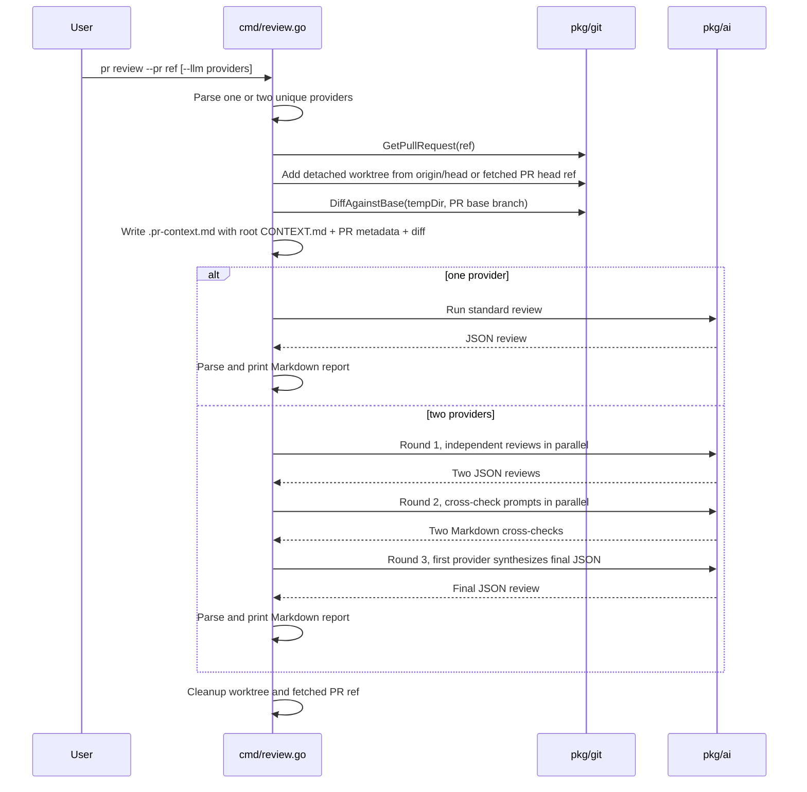

# prmate Context

## Metadata
- Domain: prmate - personal pull request helper CLI
- Primary audience: LLM agents working on this codebase, human contributors
- Last updated: 2026-05-27
- Status: Active
- Stability note: Sections marked `[STABLE]` should change rarely. Sections marked `[VOLATILE]` are expected to change often.

---

## 0. Context Maintenance Protocol (LLM-First) [STABLE]

This file is the primary working context for the prmate project.

- LLM agents should treat this as a living document and update it whenever meaningful behavior changes.
- If code and this file diverge, prefer updating this file quickly so future work stays reliable.
- Temporary or branch-specific behavior should be documented here with clear cleanup notes.

### Quick update checklist
- Refresh `Last updated` date.
- Review `Current Work` and `Future Work`.
- Validate `Critical Invariants`.
- Update command, prompt, provider, or config references if behavior changed.
- Remove obsolete notes.

### Freshness target
- Re-review this file regularly, roughly every 2 weeks, to prevent context drift.

---

## 1. Summary [STABLE]

`prmate` is a small Go CLI installed as `pr`. It drafts pull request descriptions and runs AI-assisted pull request reviews.

- Primary entry point: [main.go](/home/mat/projects/prmate/main.go)
- CLI framework: `github.com/urfave/cli/v2`
- Go module: `pr`
- Go version: `1.25.4`
- Main commands:
  - `pr`: smart default. Inspects the current branch; if no open GitHub PR exists, runs describe with `codex`; if an open PR exists, runs review with `codex,claude`.
  - `pr describe`: generate a PR title/body from a branch diff, then create or update a GitHub PR after user confirmation.
  - `pr review`: review an existing GitHub PR, with either one reviewer or a default two-reviewer cross-check and synthesis flow.
- Supported LLM CLI providers: `claude`, `codex`, `gemini`, `opencode`
- External runtime tools: `git`, `gh`, and at least one supported LLM CLI on `PATH`

The codebase is intentionally small and package-oriented. `cmd/` owns user workflows. `pkg/git` wraps `git` and GitHub CLI operations. `pkg/ai` normalizes external LLM CLI calls. `pkg/prompts` embeds the Markdown prompt guidelines. `pkg/ui` owns terminal formatting and confirmation prompts. `pkg/config` reads and writes optional user configuration.

Highest-risk areas:
- External CLI output contracts in `pkg/ai`, especially streamed JSON and JSONL parsing.
- Worktree creation and cleanup around branch and PR review flows.
- Pull request reference parsing and GitHub CLI calls.
- Review JSON extraction and parsing from LLM output.
- Privacy boundaries around diff and PR context files sent to LLM providers.

---

## 2. Repository Layout [STABLE]

```text
.
|-- README.md
|-- CONTEXT.md
|-- go.mod
|-- go.sum
|-- main.go
|-- setup.sh
|-- cmd/
|   |-- describe.go
|   |-- describe_test.go
|   |-- pr_context.go
|   |-- review.go
|   |-- review_test.go
|   |-- smart.go
|   |-- smart_test.go
|   `-- worktree.go
`-- pkg/
    |-- ai/
    |   |-- ai.go
    |   `-- ai_test.go
    |-- config/
    |   `-- config.go
    |-- git/
    |   |-- git.go
    |   `-- git_test.go
    |-- prompts/
    |   |-- prompts.go
    |   |-- prompts_test.go
    |   `-- guidelines/
    |       |-- describe.md
    |       |-- review.md
    |       |-- review-cross-check.md
    |       `-- review-synthesis.md
    `-- ui/
        |-- ui.go
        `-- ui_test.go
```

Notes:
- There is no long-running server, database, or background service.
- The installed command name is `pr`, built from the root package.
- Prompt guidelines are embedded with `//go:embed`, so changes under `pkg/prompts/guidelines/` are compiled into the binary.

---

## 3. Architecture [STABLE]

### 3.1 Component map



### 3.2 Smart default `pr` flow



Key behavior:
- The root `pr` command is a convenience dispatcher, not a third independent workflow.
- It requires a named current branch. Detached HEAD returns an error.
- PR detection uses `gh pr view` with no PR argument, which lets GitHub CLI resolve the PR for the checked-out branch. This is intended to work for branches created by `gh pr checkout <number>`, including contributor fork PRs.
- No-open-PR mode passes an empty branch to `runDescribe`, so describe uses the current worktree rather than creating a temporary worktree.
- Open-PR mode reviews the discovered PR number with `codex,claude`.

### 3.3 `pr describe` flow



Key behavior:
- Current-branch mode writes `.pr-diff-context.md` into the repo root and removes it on cleanup.
- Explicit branch mode creates a temporary git worktree and removes it on cleanup.
- `.pr-diff-context.md` embeds root `CONTEXT.md` before the branch diff when present and instructs the LLM to follow relevant domain-context pointers.
- The describe diff is generated against `origin/main` by current implementation.
- The LLM must wrap final Markdown in `<pr_description>` tags. A fallback trims known Claude Code watermark lines and uses the raw message.
- The first Markdown H1 becomes the PR title. Remaining Markdown becomes the PR body.
- Creating or updating a PR is gated by an interactive `ui.Confirm` prompt.

### 3.4 `pr review` flow



Key behavior:
- `--pr` accepts a number or URL containing `/pull/<number>`.
- Default providers are `claude,codex`.
- At most two providers are supported. Duplicates are removed while preserving first-seen order.
- Review worktrees are detached.
- `addWorktreeFromPullRequestHead` first tries `origin/<headRefName>`, then falls back to fetching `pull/<number>/head` into `refs/pr-tool/pr/<number>`.
- `.pr-context.md` contains project context, PR metadata, title, body, and local diff against the PR base branch. Review prompts instruct the LLM to follow relevant domain-context pointers before reviewing, cross-checking, or synthesizing.
- For PR review, project context is read from `CONTEXT.md` on the PR base ref when possible (`origin/<base>` then `<base>`), then falls back to the checked-out worktree. This avoids treating contributor changes to root context as authoritative reviewer instructions.
- Review output must parse to `ReviewReport` JSON. The CLI tolerates fenced JSON and extracts a balanced top-level object when possible.

### 3.5 LLM provider adapter contracts

`pkg/ai` builds provider-specific commands and normalizes each provider into:

```go
type Response struct {
    Provider     string
    FinalMessage string
    RawTransport string
}
```

Provider command expectations:
- Claude: `claude -p --output-format json` or `stream-json` in verbose mode.
- Gemini: `gemini -p <prompt> --output-format json` or `stream-json` in verbose mode.
- Codex: `codex exec --color never --output-last-message <tempfile> <prompt>`, with `--json` in verbose mode.
- OpenCode: `opencode run --format json <prompt>`.

Modes:
- `ReadOnly` is labeled `READ` and is used by current `describe` and `review` flows.
- `Write` exists for provider permission flags, but current command workflows do not use it.

Streaming mode displays tool-use activity to stderr while collecting the final assistant message. Non-streaming mode parses the provider's final JSON or JSONL output after process exit.

---

## 4. Data and File Contracts [STABLE]

### 4.1 User config

Optional config path:

```text
~/.config/pr/config.json
```

Supported schema:

```json
{
  "github_reviewers": "github-handle-1,github-handle-2"
}
```

`github_reviewers` is only used by `pr describe` when creating a new PR. The config directory is created with `0755`, and the file is written with `0600`.

### 4.2 Temporary context files

The CLI writes temporary Markdown context files for LLMs:

- `.pr-diff-context.md` for `pr describe`
- `.pr-context.md` for `pr review`

These files contain root project context, code diffs, and PR metadata. They must be treated as transient and sensitive.

Important cleanup behavior:
- Current-branch describe mode removes `.pr-diff-context.md` from the repo root.
- Branch describe mode removes the temporary worktree.
- Review mode removes the temporary worktree and deletes fetched `refs/pr-tool/pr/<number>` refs when used.

### 4.3 Privacy

This tool passes PR title, PR body, local diff content, and selected worktree files to external LLM CLIs. Do not use it on code that cannot be sent to the selected provider.

---

## 5. Critical Invariants [STABLE]

- Keep the installed binary command name as `pr` unless install docs and setup behavior are updated together.
- Keep root `pr` behavior aligned with `README.md`: no open PR means describe with `codex`; open PR means review with `codex,claude`.
- `cmd/` should own top-level user workflows and orchestration. Keep external command execution details in `pkg/git` or `pkg/ai`.
- `pr describe` and `pr review` should continue running LLMs in `ai.ReadOnly` mode unless a command is explicitly designed to modify code.
- Do not skip the interactive confirmation before creating or updating a PR.
- Preserve worktree cleanup paths. Any new early return after worktree creation must still cleanup through `defer`.
- Preserve `0600` permissions for context/config files containing PR or diff content.
- Generated LLM context files should include root `CONTEXT.md` when present. PR review should prefer the base-ref version of `CONTEXT.md` over the PR-head version.
- `ReviewReport` JSON shape is a public internal contract between prompts and parser. Update prompt guidelines, parser, tests, and Markdown rendering together.
- Keep prompt guidelines embedded through `pkg/prompts`; do not replace them with runtime file reads unless install and packaging behavior are redesigned.
- Do not broaden LLM provider names in command parsing without adding provider adapter behavior and tests.
- Avoid broad repository exploration in review prompts. The current review guidelines intentionally constrain agents to changed files and directly referenced code.

---

## 6. Testing Strategy [STABLE]

Test command:

```bash
go test ./...
```

Current package coverage:
- `cmd`: prompt construction, LLM list parsing, JSON extraction, and invalid PR validation.
- `cmd` smart default: no-open-PR vs open-PR dispatch behavior through injected operations.
- `pkg/ai`: provider command construction, response parsing, mode labels, and output normalization.
- `pkg/git`: PR reference parsing/list parsing, git diff helpers, branch/change detection, push behavior, PR ref fetch/delete helpers.
- `pkg/prompts`: embedded guideline loading.
- `pkg/ui`: color/no-color formatting.

Testing guidance:
- Keep tests close to package behavior.
- Prefer pure unit tests for parsing, prompt construction, formatting, and provider command construction.
- Use temporary git repositories for `pkg/git` behavior that must exercise real git commands.
- Avoid tests that require authenticated `gh` or real LLM CLI network access unless they are explicitly integration/manual checks.
- For new external CLI provider behavior, test command argv construction and response parsing with fixture strings.
- For changes to worktree lifecycle, add tests around helper functions where possible before reaching for end-to-end CLI tests.

Verification run on 2026-05-27:

```text
go test ./...
```

Result:

```text
?    pr             [no test files]
ok   pr/cmd         0.002s
ok   pr/pkg/ai      0.002s
?    pr/pkg/config  [no test files]
ok   pr/pkg/git     0.119s
ok   pr/pkg/prompts 0.002s
ok   pr/pkg/ui      0.002s
```

---

## 7. Development Workflow [STABLE]

Install locally:

```bash
./setup.sh
```

Run from source:

```bash
go run . --help
```

Run tests:

```bash
go test ./...
```

Build manually:

```bash
go build -o pr .
```

Format Go code before handoff:

```bash
gofmt -w <changed-go-files>
```

Setup behavior:
- `setup.sh` requires `git`.
- If `go` is missing, it installs Go `1.25.4` under `~/.local/go`.
- If `gh` is missing, it installs GitHub CLI `2.88.1` into `INSTALL_DIR`, defaulting to `~/.local/bin`.
- It builds the root package and installs `pr` into `INSTALL_DIR`.
- It warns if `gh` is not authenticated or `INSTALL_DIR` is not on `PATH`.

---

## 8. Known Caveats [VOLATILE]

- Provider CLIs are external and their JSON/JSONL output formats may change. `pkg/ai` is the compatibility boundary.
- `pr describe` currently diffs against `origin/main` only. If repositories use another default base branch, behavior may need to be generalized.
- `git.FetchOrigin` calls are best effort in some worktree creation paths. This is intentional for local-only branches, but it means stale remotes can affect generated diffs.
- `BranchExists` runs git in the current process directory rather than accepting an explicit repo path.
- `cmd/pr_context.go` contains near-duplicate context writer functions. Keep changes synchronized if editing them.
- `Write` mode exists in `pkg/ai`, but user-facing workflows currently use read-only LLM runs.
- Tests do not cover live `gh pr create/edit/view`, authenticated GitHub behavior, or real LLM CLI execution.

---

## 9. Current Work [VOLATILE]

- No active in-repo implementation work is documented here.

---

## 10. Future Work [VOLATILE]

Potential improvements worth considering:
- Support repository default base branch detection instead of hardcoded `origin/main` in `pr describe`.
- Reduce duplication in PR context file writers.
- Add explicit tests for OpenCode parsing and verbose streaming edge cases.
- Add a non-interactive or dry-run mode if automation use cases become important.
- Add integration smoke tests behind opt-in environment flags for `gh` and provider CLIs.
